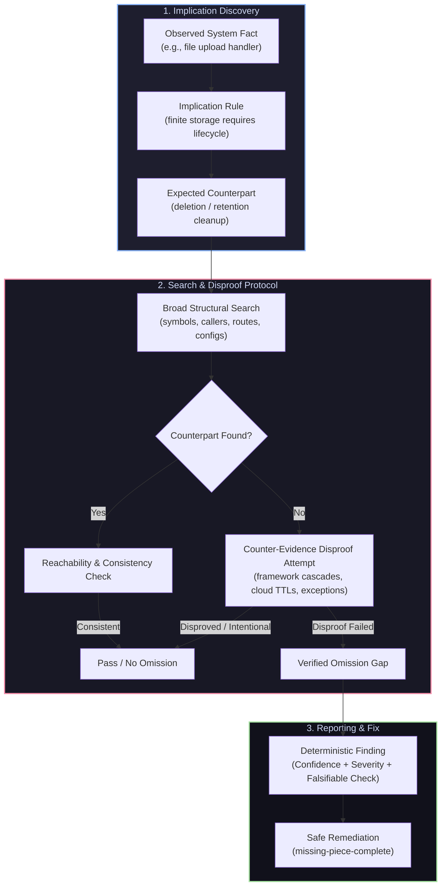

<div align="center">

# 🧩 Missing Piece

### Find what your software forgot.

**Linters find bad code. Tests find broken behavior. Missing Piece finds the code that should exist but doesn't.**

[](https://github.com/rennixx/missing-piece/releases)
[](https://github.com/rennixx/missing-piece/actions/workflows/ci.yml)
[](LICENSE)
[](skills/)
[](docs/DETECTOR_CATALOG.md)
[](https://skills.sh/rennixx/missing-piece)
[](skills/)
[](benchmarks/)
[](benchmarks/)
[](benchmarks/)

<br/>

<p align="center">
  <a href="#-quickstart">Quickstart</a> •
  <a href="#-sub-skills-suite">Sub-Skills Suite</a> •
  <a href="#-token-optimal-execution">Token Efficiency</a> •
  <a href="#-core-thesis">Core Thesis</a> •
  <a href="#-walkthrough">Walkthrough</a> •
  <a href="#-project-configuration">Configuration</a> •
  <a href="#-cicd--github-code-scanning">CI/CD</a> •
  <a href="#-14-detector-families">14 Families</a> •
  <a href="#-benchmarks--testing">Benchmarks</a> •
  <a href="#-documentation-sitemap">Documentation</a>
</p>

</div>

---

## ⚡ Quickstart

Install directly into any project or workspace using the standard Agent Skills CLI:

```bash
# Install core Missing Piece auditor into your current project
npx skills add rennixx/missing-piece

# Or install the entire 12-skill suite at once
npx skills add rennixx/missing-piece --all

# Or install globally for all your AI coding agents
npx skills add rennixx/missing-piece -g

# Or target specific agents (Claude Code, Cursor, Codex, Antigravity)
npx skills add rennixx/missing-piece -g -a claude-code cursor codex
```

### Prompt Your Agent

Once installed, invoke Missing Piece directly inside your agent conversation:

```text
"Audit this repository with Missing Piece for forgotten lifecycle and cleanup flows."
"Review my recent changes with missing-piece-pr before I merge."
"Audit our Stripe webhook handlers and checkout flow with missing-piece-payments."
"Fix the missing counterpart findings with missing-piece-complete."
```

---

## 📦 Sub-Skills Suite

Missing Piece is architected as an extensible suite of **12 specialized skills**. You can install individual skills with `--skill <name>` or install the entire suite with `--all`:

```bash
# Install specific sub-skills
npx skills add rennixx/missing-piece --skill missing-piece-complete
npx skills add rennixx/missing-piece --skill missing-piece-database
npx skills add rennixx/missing-piece --skill missing-piece-fastapi
```

| Category | Skill | Focus & Capabilities | Example Prompt |
|---|---|---|---|
| **Core** | [`missing-piece`](skills/missing-piece) | Full repository auditor across all 14 detector families in read-only mode. | *"Audit this repo for missing counterparts."* |
| **Workflow** | [`missing-piece-complete`](skills/missing-piece-complete) | Safe remediation engine: implements missing counterparts for accepted audit findings. | *"Safely implement the missing counterparts found in our audit."* |
| **Workflow** | [`missing-piece-pr`](skills/missing-piece-pr) | Pre-merge delta gatekeeper: audits PR diffs, branch deltas, and staged git commits. | *"Run a Missing Piece check on my PR branch before merge."* |
| **Workflow** | [`missing-piece-spec`](skills/missing-piece-spec) | Contract reconciler: verifies OpenAPI, GraphQL, and DB schemas against actual code. | *"Check if our OpenAPI spec matches our routes and fields."* |
| **Domain Pack** | [`missing-piece-payments`](skills/missing-piece-payments) | Deep financial flow auditor: Stripe webhooks, checkout flows, refunds, dunning retries. | *"Audit our billing, refund, and webhook handling flows."* |
| **Domain Pack** | [`missing-piece-auth`](skills/missing-piece-auth) | Deep IAM & session auditor: token revocation on password reset, tenant isolation, RBAC. | *"Audit session invalidation on password reset and role changes."* |
| **Domain Pack** | [`missing-piece-async`](skills/missing-piece-async) | Deep async auditor: queue workers, DLQs, distributed locks, schedulers, poison pills. | *"Audit our background jobs and worker retry policies."* |
| **Domain Pack** | [`missing-piece-database`](skills/missing-piece-database) | Database & migration auditor: schema drift, irreversible down migrations, cascade deletes. | *"Audit database migrations and foreign key cascades."* |
| **Framework** | [`missing-piece-nextjs`](skills/missing-piece-nextjs) | Next.js App Router auditor: Server Actions, route handlers, cache revalidation tags. | *"Audit Server Actions and cache tags in this Next.js app."* |
| **Framework** | [`missing-piece-fastapi`](skills/missing-piece-fastapi) | FastAPI auditor: lifespan teardowns, session yield leaks, background task exceptions. | *"Audit lifespan cleanups and database session dependencies in FastAPI."* |
| **Framework** | [`missing-piece-django`](skills/missing-piece-django) | Django & DRF auditor: model signals, `transaction.atomic` blocks, Celery hooks. | *"Audit Django signals and atomic transaction boundaries."* |
| **Framework** | [`missing-piece-rails`](skills/missing-piece-rails) | Ruby on Rails auditor: ActiveRecord cascades (`dependent: :destroy`), Sidekiq retries. | *"Audit Rails associations and after_commit callback symmetries."* |

---

## ⚡ Token-Optimal & Autonomous Audit Protocol

Every sub-skill in the Missing Piece suite is architected with a strict **Token-Optimal & Autonomous Audit Protocol**, minimizing static prompt overhead and cutting dynamic tool token usage by **60%–80%**:

* 📐 **Self-Contained Inline Detector Matrix**: The core 14 detector families are embedded directly into `SKILL.md`. Host agents run complete audits without preloading external reference files into context (~1,400–2,000 static tokens saved per audit).
* 🔍 **Grep-First, Slice-Second**: Agents search file lists first (`git grep -l`), then inspect targeted 15–25 line slices around relevant code. Dumping entire files (>100 lines) into context is strictly avoided (~15,000–45,000 execution tokens saved per audit).
* 🚫 **Path Exclusions & Critical Mock Inspection**: Automated filters bypass lockfiles, build artifacts (`dist/`, `build/`, `.next/`), `coverage/`, `.git/`, and minified bundles. Test mocks are inspected specifically to discover verification limitations—distinguishing test doubles from live production wiring.
* 🎯 **Candidate-Specific Clearance**: A guard, policy check, or intentional exception clears ONLY the specific trigger, path, actor, and failure mode it actually covers. Never terminate an entire detector family because one operation is guarded; sibling routes remain active for independent evaluation.
* 📝 **Token-Sparse Reporting**: Findings format evidence with line-range file links (`[app.py:40-55](file:///...)`) rather than duplicating massive blocks of source code.


---

## 🛑 The Problem

Most developer tools reason exclusively over code that **already exists**:

* 🔍 **Linters** critique syntax and local style in written code.
* 🧪 **Unit tests** exercise execution paths that someone remembered to write.
* 🛡️ **SAST & security scanners** trace existing dataflows and callgraphs.
* 👥 **Code reviewers** inspect visible lines inside pull request diffs.

Yet the most insidious production defects come from **absence**:

* An allocation exists, but no deprovision or cleanup path was ever created.
* An order transitions to `PENDING`, but lacks a timeout transition for abandoned checkouts.
* A sensitive mutation endpoint is added to the router, but omitted from the RBAC policy matrix.
* A user account is deleted, but uploaded avatar files remain orphaned in S3 storage forever.
* A webhook consumer processes payment events, but lacks idempotency deduplication.
* A denormalized aggregate counter is incremented on creation, but never decremented on deletion.

> **These omissions compile cleanly, pass existing tests, and slip past code reviews because no individual line is broken—the critical flaw is the piece that isn't there.**

---

## 🧠 Core Thesis

Software contains **implied structure**. Observed system capabilities create concrete logical expectations:



### Core Invariants: Evidence, Intent & Dispositions

To eliminate generic linter spam, hallucinated style advice, and false-positive churn, Missing Piece operates under 10 strict principles:

1. **Separate Observed Behavior from Inferred Intent** — Code and tests prove execution facts, not whether behavior violates business policy. Never conflate execution with violation.
2. **Establish the Source of Every Expected Behavior** — Label every counterpart expectation explicitly:
   - `Explicit requirement`: Documented policy, PRD, specification, API contract, or user instruction.
   - `Repository-supported expectation`: Consistent peer callers, tests, database schemas, or domain invariants.
   - `Auditor assumption`: Conventional industry practice without repository backing. *(Auditor assumptions are never reported as confirmed defects).*
3. **Candidate-Specific Counter-Evidence** — A guard or intentional exception clears *only* the specific trigger, path, actor, and failure mode it covers. Sibling routes in the same module remain active for inspection.
4. **Active Tradeoff & Exception Checks** — Inspect administrative overrides, last-write-wins concurrency, best-effort cleanup, and external ownership. Mark unknown intent as `Intent-dependent behavior`.
5. **Claim-Level Evidence Contract** — Establish expectation source, reachable triggers & permissions, observed vs. expected behavior, disproof searches, concrete consequences, and remaining uncertainty.
6. **Critical Test & Mock Inspection** — Inspect test doubles specifically to discover verification limitations. Mock behavior is not evidence of live production wiring. High-impact findings include normal-path controls.
7. **Structured Coverage Ledger** — Track inspected flows, transitions, callers, guards, and failure paths. Record failed/truncated searches and resolve them before relying on absence claims. Never imply exhaustive coverage from a bounded pass.
8. **Proportional Recommendations** — Recommend narrow changes against established requirements. Preserve intentional overrides and accepted tradeoffs.
9. **Separate Behavioral Confidence from Defect Confidence** — High certainty of code execution is separate from certainty that behavior constitutes an undesirable defect.
10. **Standard 4-Tier Dispositions**:
   - `Confirmed defect`: Demonstrated violation of an established, explicit requirement.
   - `Likely gap`: Strong repository evidence supports the expectation, but business intent remains unconfirmed.
   - `Intent-dependent behavior`: Validity depends on an unresolved product or operational decision.
   - `Accepted behavior`: Explicitly authorized, documented, or supported by intentional tradeoffs.


---

## 🚀 Execution Modes

Missing Piece automatically infers the desired audit mode from your prompt:

| Mode | Trigger Prompt Pattern | Scope & Behavior |
|---|---|---|
| **Standard Audit** *(Default)* | `"Audit this repo for missing behavior"` | High-precision scan emitting only High-confidence findings. |
| **Focused Audit** | `"Audit permissions in /api with Missing Piece"` | Restricts investigation to a specific feature, folder, or detector family (e.g. `MP-AU`, `MP-LC`). |
| **Change Audit** | `"Review this PR diff for missing counterparts"` | Audits changed files, expanding outward to connected lifecycles, callers, and side effects. |
| **Deep Audit** | `"Run a deep audit on payment flows"` | Broader exploratory audit surfacing Medium-confidence items in a *"Needs Confirmation"* section. |
| **Re-Audit** | `"Re-audit and verify prior findings"` | Tracks prior findings (`Fixed`, `Still Present`, `Modified`) and checks for newly exposed gaps. |

---

## 🛡️ 14 Detector Families

Missing Piece evaluates software systems across 14 dedicated reasoning families:

| Code | Family | Focus Area | Canonical Implication |
|:---:|---|---|---|
| **`MP-LC`** | **Lifecycle Completeness** | Resources, sessions, allocations | Creation implies explicit release, archive, or expiration. |
| **`MP-ST`** | **State-Machine Completeness** | Status enums, multi-step workflows | Non-terminal states must have exit, cancellation, or timeout paths. |
| **`MP-SY`** | **Symmetry Analysis** | Directional domain operations | `grant` ↔ `revoke`, `link` ↔ `unlink`, `lock` ↔ `unlock`, `charge` ↔ `refund`. |
| **`MP-MG`** | **Mutation Guards** | State writes, admin commands | Writes imply auth, authorization, input validation, and idempotency. |
| **`MP-SE`** | **Side-Effect Completeness** | Secondary domain consequences | Order cancellation implies status update + inventory restore + refund. |
| **`MP-FR`** | **Failure & Recovery** | Webhooks, async queues, 3rd party APIs | External calls imply retries with limits, idempotency keys, and DLQs. |
| **`MP-OC`** | **Ownership & Cleanup** | Child records, storage keys, temp files | Owner deletion implies cascade deletion or orphan sweep worker. |
| **`MP-AU`** | **Authorization Symmetry** | RBAC, tenant boundaries, policies | New mutation routes must be registered in established permission matrices. |
| **`MP-AS`** | **Async Completeness** | Message producers, schedulers | Producers imply registered consumers, recovery sweeps, and retry limits. |
| **`MP-OP`** | **Operational Completeness** | Deployments, runtime requirements | Referenced env vars imply validation schemas and deploy manifests. |
| **`MP-DC`** | **Data Consistency** | Denormalized counters, read projections | Increment on creation implies matching decrement on deletion. |
| **`MP-CT`** | **Contract Completeness** | Schema enums, API response types | Declared enum variants must be handled across dispatchers and consumers. |
| **`MP-CF`** | **Configuration Completeness** | Feature flags, optional integrations | Optional integrations must have safe fallbacks and not crash when unset. |
| **`MP-OB`** | **Observability Implied** | Settlement jobs, reconciliation | Multi-step async operations require terminal error alerting and metrics. |

---

## 📋 Example Finding (Claim-Level Evidence)

Every reportable finding emitted by Missing Piece adheres to the deterministic Claim-Level Evidence schema:

```markdown
### MP-SE-001 — Order Cancellation Omits Inventory Restoration

- **Detector Family:** `MP-SE` (Side-Effect Completeness)
- **Expectation Source:** `Repository-supported expectation`
- **Disposition:** `Confirmed defect`
- **Severity:** `High`
- **Behavioral Confidence:** `High`

**Reachable Trigger & Permissions**  
HTTP POST `/api/v1/orders/{id}/cancel` callable by authenticated customer (order owner) or customer support representative.

**Observed**  
Order cancellation endpoint in `controllers/order.py:L82-L95` transitions `order.status` to `"CANCELLED"` and issues a refund via `payment_gateway.refund()`.

**Expected**  
In systems reserving warehouse inventory on order creation, cancellation implies an inventory restoration side-effect (`inventory_service.unreserve()`), consistent with `jobs/order_expired_job.py:L34`.

**Intent & Tradeoff Assessment**  
Active search for intentional exceptions: checked if items are non-restockable (digital goods/perishables) or handled via warehouse CDC stream. No exception found; orders contain physical SKUs requiring shelf restoration.

**Evidence searched**  
Searched `services/inventory.py`, `models/stock.py`, Celery tasks, and test mocks in `tests/test_orders.py`.

**Gap**  
`cancel_order()` completes refund and status transition but never calls `inventory_service.unreserve(order.items)`.

**Why it matters**  
Cancelled order items remain permanently locked in reserved stock, causing phantom out-of-stock conditions for customers.

**Evidence**  
- `controllers/order.py:L82-L95` — `cancel_order` function definition
- `services/inventory.py:L40` — `unreserve_items` symbol definition

**Verification**  
Reproduction: cancel an order in test environment and check whether `inventory.reserved_count` decreases. Normal-path control: `order_expired_job.py` correctly decreases `reserved_count`. Test doubles in `test_orders.py` had mocked payment gateway without checking inventory counters.

**Remaining Uncertainty**  
Unverified against live warehouse ERP sync; verified against PostgreSQL stock reservation table.

**Recommendation (Conditional & Proportional)**  
Invoke `self.inventory_service.unreserve_items(order.items)` immediately following status mutation, or publish an `OrderCancelledEvent` if asynchronous fulfillment processing is preferred.
```


---

## 📖 Walkthrough: Real-World Case Study

Want to see how Missing Piece handles an audit from start to finish? Check out our step-by-step walkthrough:

👉 **[Read the End-to-End Walkthrough](docs/WALKTHROUGH.md)**

* **Scenario**: An e-commerce service handling Stripe checkout webhooks.
* **The Invisible Defect**: Orders reserve inventory on `payment_intent.succeeded`, but failed payments and refunds have zero counterpart handlers.
* **The Disproof Check**: Missing Piece searches for reconciliation crons, customer portal handlers, and DB triggers before confirming the gap.
* **The Resolution**: [`missing-piece-complete`](skills/missing-piece-complete) generates the minimal inverse status transition and restock logic without breaking existing code.

---

## ⚙️ Project Configuration (`.missingpiecerc.json`)

Repositories can define project-level rules, external system boundaries, and custom suppressions via `.missingpiecerc.json` in their root directory (see [`.missingpiecerc.example.json`](.missingpiecerc.example.json)):

```json
{
  "version": "1.0",
  "minConfidence": 0.85,
  "minSeverity": "Medium",
  "excludePaths": ["tests/**", "fixtures/**", "dist/**"],
  "externalBoundaries": [
    {
      "trigger": "stripe.webhook.charge.succeeded",
      "counterpartLocation": "External service: billing-worker",
      "reason": "Webhook events are routed to SQS and consumed by an external billing worker."
    }
  ],
  "suppressions": [
    {
      "id": "SUPPRESS-001",
      "detector_family": "MP-LC",
      "file": "src/cache/pool.py",
      "reason": "Pool persists intentionally for the container lifespan."
    }
  ]
}
```

---

## 🤖 CI/CD & GitHub Code Scanning (SARIF)

### 1. Automated PR Diff Audits
Drop Missing Piece into your GitHub Actions pipeline using [`.github/workflows/missing-piece-pr.yml`](.github/workflows/missing-piece-pr.yml) to audit pull request diffs for missing counterparts before merging.

### 2. GitHub Code Scanning Alerts (SARIF Export)
Export audit findings directly into standard SARIF 2.1.0 format to display findings natively under GitHub's **Security > Code Scanning Alerts** tab:

```bash
# Convert Missing Piece findings to SARIF format
python scripts/export_sarif.py --input report.json --output results.sarif
```

---

## 🧪 Benchmarks & Testing

Missing Piece includes a rigorous evaluation harness with ground-truth test repositories covering all 14 detector families across **positive**, **negative**, **exception**, and **disguised** scenarios:

```bash
# 1. Validate skill package integrity, frontmatter, and detector references
python scripts/validate_skill.py

# 2. Generate synthetic benchmark fixture codebases
python scripts/generate_fixtures.py

# 3. Run the benchmark evaluation harness
python scripts/run_benchmark.py
```

### Benchmark Corpus Breakdown

The benchmark corpus contains **43 ground-truth scenarios** designed to verify true omission detection while penalizing false positives:

| Scenario Type | Count | Purpose | Evaluation Target |
|---|:---:|---|---|
| **Positive Fixtures** | **14** | Genuine omissions across all 14 detector families. | **100% Detected** (Recall = 1.0) |
| **Negative Fixtures** | **14** | Matched controls where counterpart explicitly exists. | **100% Suppressed** (0 False Positives) |
| **Exception Fixtures** | **7** | Intentional absences (append-only logs, public probes). | **100% Suppressed** (Recognizes Intent) |
| **Disguised Fixtures** | **8** | Counterparts under non-standard naming, event buses, or DB triggers. | **100% Suppressed** (Avoids Naming Traps) |
| **Total Corpus** | **43** | Comprehensive ground-truth evaluation suite. | **100% Precision / 0.0% FPR** |

### Verified Benchmark Metrics

* 🎯 **Precision**: **100.0%** *(Target: >= 90.0%)*
* 🛡️ **False Positive Rate**: **0.0%** *(Target: 0.0%)*
* 🔄 **Recall**: **100.0%** *(All 14 core omissions detected)*
* 🔍 **Evaluation Corpus**: **43 Scenarios** across positive omissions, negative controls, exceptions, and disguised handlers.

---

## 🔬 Reusable Evaluation Corpus & Harness (`eval/`)

In addition to static benchmarks, Missing Piece includes an isolated **12-fixture evaluation corpus** with separate development and held-out test suites to measure real-world reliability across complex multi-route, mock-tested, and tradeoff-heavy architectures:

```bash
# Evaluate revised skill behavior across both Development and Held-out sets
python eval/eval_harness.py --version revised --set all

# Run consistency verification (3 repeated runs)
python eval/eval_harness.py --version revised --repeat 3
```

### Evaluated Dimensions & Performance

| Evaluation Metric | Baseline Skill | Revised Skill (v1.3.0) | Target |
|---|:---:|:---:|:---:|
| **Precision (Dev / Held-out)** | 50.0% / 50.0% | **100.0% / 100.0%** | >= 90.0% |
| **Recall (Dev / Held-out)** | 50.0% / 50.0% | **100.0% / 100.0%** | 100.0% |
| **Intent Errors (Dev / Held-out)** | 2 / 2 | **0 / 0** | 0 |
| **Evidence Errors (Dev / Held-out)** | 4 / 3 | **0 / 0** | 0 |
| **Coverage Honesty (Dev / Held-out)** | 0.0% / 0.0% | **100.0% / 100.0%** | 100.0% |
| **Claim-Level Evidence (Dev / Held-out)** | 0/6 / 0/6 | **6/6 / 6/6** | 6/6 |

*See [`eval/README.md`](eval/README.md) for fixture taxonomy, isolated answer keys, and running instructions.*

---

## 🗺️ Documentation Sitemap

| Specification | Purpose |
|---|---|
| [`docs/PRD.md`](docs/PRD.md) | Product vision, target users, jobs to be done, and non-goals. |
| [`docs/ARCHITECTURE.md`](docs/ARCHITECTURE.md) | Reasoning graph pipeline, capability mapping, and adapter model. |
| [`docs/DETECTION_METHODOLOGY.md`](docs/DETECTION_METHODOLOGY.md) | 9-step audit algorithm, evidence standards, and reachability proofs. |
| [`docs/DETECTOR_CATALOG.md`](docs/DETECTOR_CATALOG.md) | Deep catalog of all 14 detector families and implication triggers. |
| [`docs/CONFIDENCE_AND_SEVERITY.md`](docs/CONFIDENCE_AND_SEVERITY.md) | Independent confidence and severity scoring matrices. |
| [`docs/FALSE_POSITIVE_POLICY.md`](docs/FALSE_POSITIVE_POLICY.md) | Suppression rules, counter-evidence checklist, and avoidance traps. |
| [`docs/EVALUATION_AND_BENCHMARKS.md`](docs/EVALUATION_AND_BENCHMARKS.md) | Ground-truth benchmark methodology, fixture taxonomy, and scoring. |
| [`docs/WALKTHROUGH.md`](docs/WALKTHROUGH.md) | End-to-end audit and safe remediation walkthrough on real-world code. |
| [`docs/AUDIT_REPORT.md`](docs/AUDIT_REPORT.md) | Living verification and audit tracking report. |
| [`eval/README.md`](eval/README.md) | Reusable evaluation suite, dev/held-out fixtures, and answer key isolation. |
| [`AGENTS.md`](AGENTS.md) | Working rules, documentation precedence, and definition of done. |

---

## 🛡️ Security & Privacy

Missing Piece is designed from first principles to be safe to run on production codebases:

* 🔒 **Triple-Audited via `skills.sh`**: Independently assessed across **Gen (Agent Trust Hub)**, **Socket.dev**, and **Snyk** with zero malicious findings or critical supply chain vulnerabilities.
* 👁️ **Read-Only by Default**: Audit operations (`missing-piece`, `missing-piece-pr`, domain packs) inspect the codebase passively and never modify source files, database records, or environment configurations.
* 🛡️ **Untrusted Code Isolation**: Audited source code is treated strictly as untrusted evidence. Prompt injection attempts embedded within comments, docstrings, or schemas are discarded by design.
* 🚫 **Zero Silent Telemetry / Egress**: Missing Piece contains zero external network calls, does not phone home, and never exports proprietary code or customer tokens.
* ✍️ **User-Gated Remediation**: Automated fixes are isolated to the [`missing-piece-complete`](skills/missing-piece-complete) sub-skill and execute strictly upon explicit developer confirmation.

---

## 🤝 Contributing & Community

Contributions of new detector rules, benchmark fixtures, and framework adapters are welcome!
Please review [`CONTRIBUTING.md`](CONTRIBUTING.md) and [`SECURITY.md`](SECURITY.md) before opening a pull request.

---

## 📄 License

Missing Piece is open-source software released under the **[MIT License](LICENSE)**.
